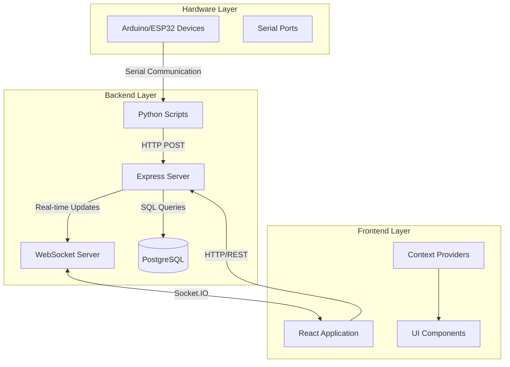
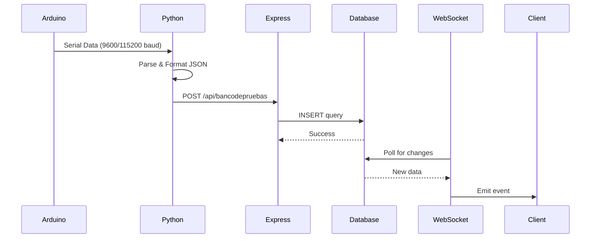
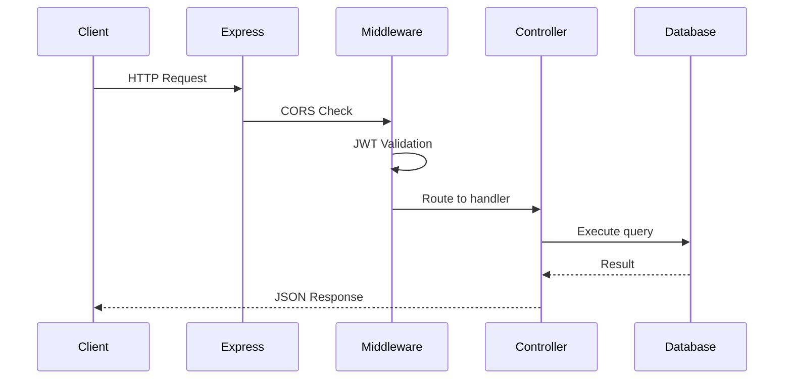
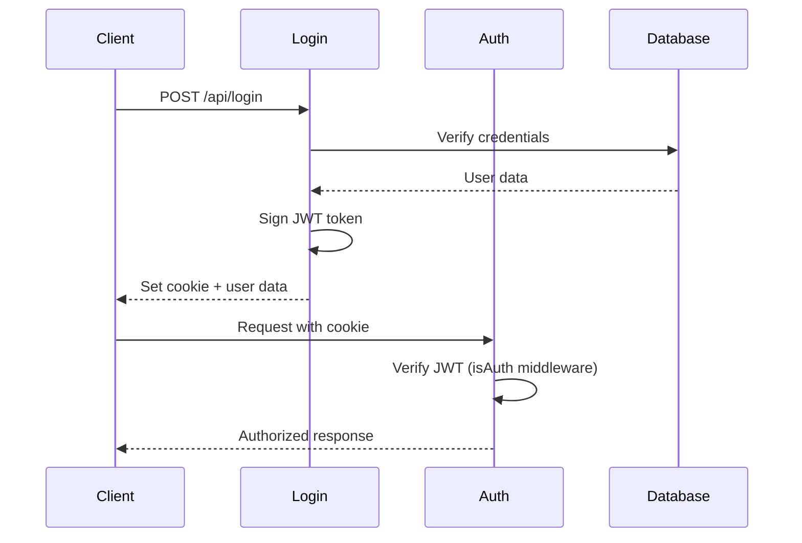

## System Architecture

SAFI ControlHub is a full-stack web application designed for real-time monitoring and control of aerospace test systems. The architecture consists of three main layers:



## Technology Stack

### Backend

- **Runtime**: Node.js with ES Modules
- **Framework**: Express.js
- **Database**: PostgreSQL with `pg` pool
- **Real-time**: Socket.IO for WebSocket communication
- **Authentication**: JWT (JSON Web Tokens) with cookie-based sessions
- **Hardware Integration**: Python scripts for serial communication

### Frontend

- **Framework**: React 18 with Vite
- **Routing**: React Router v6
- **State Management**: React Context API
- **UI Library**: Material-UI (MUI) with custom theme
- **Real-time**: Socket.IO client
- **HTTP Client**: Axios
- **3D Visualization**: React Three Fiber (@react-three/fiber)

### Hardware Communication

- **Serial Library**: pySerial (Python) and serialport (Node.js)
- **Protocols**: Serial UART communication over USB
- **Supported Devices**: Arduino, ESP32

## Core Components

### Server Entry Point

The application starts in `src/index.js:1`:

```javascript
import app from "./app.js";
import { createServer } from "http";
import { initWebSocket } from "./websocket.js";

const server = createServer(app);
initWebSocket(server);
server.listen(PORT);
```

This creates an HTTP server that serves both the REST API and WebSocket connections.

### Database Connection

PostgreSQL connection pool configured in `src/db.js:1`:

```javascript
export const pool = new pg.Pool({
  port: PG_PORT,
  host: PG_HOST,
  user: PG_USER,
  password: PG_PASSWORD,
  database: PG_DATABASE,
});
```

The pool is used throughout the application for executing SQL queries.

## Data Flow Architecture

### 1. Hardware to Database Flow



### 2. Client to Server Flow



## Real-time Data Channels

The WebSocket server (`src/websocket.js:1`) manages multiple data channels:

<Accordion title="WebSocket Channels">

| Channel | Data Source | Update Interval | Description |
|---------|-------------|-----------------|-------------|
| `nuevos-datos` | `data` table | 100ms | Main telemetry data |
| `banco-datos` | `prueba_estatica_0` table | 500ms | Test bench data |
| `xitzin2-datos` | `xitzin_2_data` table | 200ms | Xitzin-II telemetry |
| `baterias` | `battery_status` table | 5000ms | Battery monitoring |
| `xitzin2-baterias` | `xitzin_2_batteries` table | 5000ms | Xitzin-II batteries |
| `laniakea` | `datos_laniakea` table | 200ms | Laniakea GPS data |
| `ignicion-estado` | In-memory state | Event-based | Ignition command |

</Accordion>

## Authentication Flow

JWT-based authentication with HTTP-only cookies:



The `isAuth` middleware (`src/middlewares/auth.middleware.js:3`) validates tokens on protected routes.

## Project Structure Overview

### Backend (`~/workspace/source/src/`)

```
src/
├── index.js              # Server entry point
├── app.js                # Express configuration
├── websocket.js          # WebSocket server
├── SerialReader.js       # Serial port reader (Node.js)
├── db.js                 # Database connection pool
├── config.js             # Environment configuration
├── routes/               # API route definitions
│   ├── auth.routes.js
│   ├── data.routes.js
│   ├── tasks.routes.js
│   └── users.routes.js
├── controllers/          # Request handlers
│   ├── auth.controller.js
│   ├── data.controller.js
│   ├── tasks.controller.js
│   └── user.controller.js
├── middlewares/          # Custom middleware
│   ├── auth.middleware.js
│   └── validate.middleware.js
├── schemas/              # Validation schemas (Zod)
├── libs/                 # Utility libraries
└── arduino/              # Python serial scripts
    ├── bancodepruebas.py
    ├── laniakea.py
    ├── LoRa_cv.py
    └── calculos_filamentadora.py
```

### Frontend (`~/workspace/source/frontend/src/`)

```
frontend/src/
├── main.jsx              # React app entry point
├── App.jsx               # Root component with routing
├── pages/                # Page components (20 pages)
│   ├── MainPage.jsx
│   ├── Dashboard.jsx
│   ├── Banco.jsx
│   ├── Laniakea.jsx
│   └── ...
├── components/           # Reusable components
│   ├── navbar/
│   ├── tasks/
│   └── ui/
├── context/              # React Context providers
│   ├── AuthContext.jsx
│   ├── DataContext.jsx
│   ├── TaskContext.jsx
│   └── UserContext.jsx
├── api/                  # API integration
│   ├── axios.js
│   ├── useWebsocket.js
│   ├── data.api.js
│   └── tasks.api.js
└── utils/                # Helper functions
```

## Environment Configuration

The backend uses environment variables for configuration (`src/config.js:1`):

- **PORT**: Server port (default: 3000)
- **ORIGIN**: CORS allowed origins
- **PG_HOST, PG_PORT, PG_USER, PG_PASSWORD, PG_DATABASE**: PostgreSQL connection

Multiple development origins are whitelisted in `src/app.js:17-25` for local network access.

## Next Steps

- [Backend Structure](/development/backend-structure) - Detailed backend code organization
- [Frontend Structure](/development/frontend-structure) - React component architecture
- [Serial Communication](/development/serial-communication) - Hardware integration details