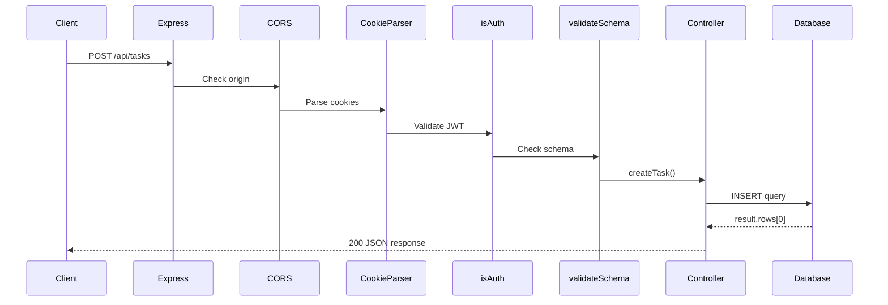

## Backend Overview

The SAFI ControlHub backend is built with Express.js and follows a modular MVC-style architecture. All backend code resides in `~/workspace/source/src/`.

## Server Initialization

### Entry Point: `src/index.js`

The application starts here (`src/index.js:1`):

```javascript
import app from "./app.js";
import { createServer } from "http";
import { initWebSocket } from "./websocket.js";
import { PORT } from "./config.js";

const server = createServer(app);
initWebSocket(server);

server.listen(PORT, () =>
  console.log("Servidor HTTP + WS corriendo en puerto", PORT)
);
```

This creates a single HTTP server that handles both REST API and WebSocket connections.

## Express Application: `src/app.js`

### Middleware Stack

Middleware is applied in the following order (`src/app.js:15-42`):

<Accordion title="1. CORS Configuration">

```javascript
const allowedOrigins = [
  'http://localhost:5173',
  'http://192.168.1.8:5173',
  'http://192.168.100.18:5173',
  'http://192.168.1.140:5173',
  'http://192.168.1.130:5173',
  'http://172.26.50.96:5173/', 
  'http://192.168.1.107:5173'
];

app.use(cors({
  origin: function (origin, callback) {
    if (!origin || allowedOrigins.indexOf(origin) !== -1) {
      callback(null, true);
    } else {
      callback(new Error('Not allowed by CORS'));
    }
  },
  methods: ['GET', 'POST', 'PUT', 'DELETE'],
  credentials: true,
}));
```

Supports credentials (cookies) and multiple development environments.

</Accordion>

<Accordion title="2. Standard Middleware">

```javascript
app.use(morgan("dev"));                        // HTTP request logger
app.use(cookieParser());                        // Parse cookies for JWT
app.use(express.json());                        // Parse JSON bodies
app.use(express.urlencoded({ extended: false })); // Parse URL-encoded bodies
```

</Accordion>

### Route Registration

Routes are mounted under `/api` prefix (`src/app.js:50-53`):

```javascript
app.use("/api", taskRoutes);   // Task management
app.use("/api", usersRoutes);  // User management
app.use("/api", authRoutes);   // Authentication
app.use("/api", dataRoutes);   // Telemetry data
```

### Global Error Handler

Catches all errors and returns JSON response (`src/app.js:57-62`):

```javascript
app.use((err, req, res, next) => {
  res.status(500).json({
    status: "error",
    message: err.message,
  });
});
```

## Directory Structure

### Routes (`src/routes/`)

Define API endpoints and apply middleware:

#### `tasks.routes.js`

```javascript
import Router from "express-promise-router";
import { createTask, deleteTask, getAllTasks, getTask, updateTask } from "../controllers/tasks.controller.js";
import { isAuth } from "../middlewares/auth.middleware.js";
import { validateSchema } from "../middlewares/validate.middleware.js";

const router = Router();

router.get("/tasks", getAllTasks);
router.get("/tasks/:id", isAuth, getTask);
router.post("/tasks", isAuth, validateSchema(createTaskSchema), createTask);
router.put("/tasks/:id", isAuth, validateSchema(updateTaskSchema), updateTask);
router.delete("/tasks/:id", isAuth, deleteTask);
```

**File**: `src/routes/tasks.routes.js:1`

#### `data.routes.js`

Handles telemetry data for multiple systems (`src/routes/data.routes.js:1`):

```javascript
// AKBAL-II Rocket
router.get("/data", getAllData);
router.post("/data", postData);
router.get("/batteries", getAllBatteries);
router.post("/batteries", updateBatteries);

// XITZIN-II Rocket
router.get("/xitzin2data", getAllXitzin2Data);
router.post("/xitzin2data", postXitzin2Data);
router.get("/xitzin2batteries", getAllXitzin2Batteries);
router.post("/xitzin2batteries", updateXitzin2Batteries);

// Test Bench
router.get("/bancodepruebas", getBancoData);
router.post("/bancodepruebas", postBancoData);
router.post("/ignicion", ignicion);
router.get("/ignicion", getignicion);

// LANIAKEA GPS Tracking
router.get("/laniakea", getLaniakeaData);
router.post("/laniakea", postLaniakeaData);
```

### Controllers (`src/controllers/`)

Implement business logic and database operations:

#### `tasks.controller.js`

Example controller implementation (`src/controllers/tasks.controller.js:1`):

<Accordion title="getAllTasks">

```javascript
export const getAllTasks = async (req, res, next) => {
  const result = await pool.query("SELECT * FROM task");
  return res.json(result.rows);
};
```

Simple query with no authentication required.

</Accordion>

<Accordion title="createTask">

```javascript
export const createTask = async (req, res, next) => {
  const { title, description } = req.body;

  try {
    const result = await pool.query(
      "INSERT INTO task (title, description, user_id) VALUES ($1, $2, $3) RETURNING *",
      [title, description, req.userId]
    );

    res.json(result.rows[0]);
  } catch (error) {
    if (error.code === "23505") {
      return res.status(409).json({
        message: "Ya existe una tarea con ese titulo",
      });
    }
    next(error);
  }
};
```

Uses `req.userId` from JWT middleware. Handles unique constraint violations.

</Accordion>

<Accordion title="updateTask">

```javascript
export const updateTask = async (req, res) => {
  const id = req.params.id;
  const { title, description } = req.body;

  const result = await pool.query(
    "UPDATE task SET title = $1, description = $2 WHERE id = $3 RETURNING *",
    [title, description, id]
  );

  if (result.rowCount === 0) {
    return res.status(404).json({
      message: "No existe una tarea con ese id",
    });
  }

  return res.json(result.rows[0]);
};
```

Returns 404 if task not found.

</Accordion>

#### `data.controller.js`

Handles telemetry data from multiple rocket systems and test equipment. This is the largest controller at **13,144 bytes** with functions for:

- AKBAL-II rocket telemetry (`getAllData`, `postData`)
- Battery monitoring (`getAllBatteries`, `updateBatteries`)
- XITZIN-II rocket data (`getAllXitzin2Data`, `postXitzin2Data`)
- Test bench data (`getBancoData`, `postBancoData`)
- Ignition commands (`ignicion`, `getignicion`)
- LANIAKEA GPS tracking (`getLaniakeaData`, `postLaniakeaData`)

**File**: `src/controllers/data.controller.js:1`

### Middlewares (`src/middlewares/`)

#### `auth.middleware.js`

JWT authentication middleware (`src/middlewares/auth.middleware.js:3`):

```javascript
import jwt from "jsonwebtoken";

export const isAuth = (req, res, next) => {
  const token = req.cookies.token;

  if (!token) {
    return res.status(401).json({
      message: "No estas autorizado",
    });
  }

  jwt.verify(token, "xyz123", (err, decoded) => {
    if (err)
      return res.status(401).json({
        message: "No estas autorizado",
      });

    req.userId = decoded.id; 
    next();
  });
};
```

- Reads JWT from HTTP-only cookie
- Verifies token signature
- Injects `userId` into request object
- Returns 401 Unauthorized if invalid

#### `validate.middleware.js`

Schema validation using Zod (`src/middlewares/validate.middleware.js:1`):

```javascript
export const validateSchema = (schema) => (req, res, next) => {
  try {
    schema.parse(req.body);
    next();
  } catch (error) {
    return res.status(400).json({ message: error.errors.map(e => e.message) });
  }
};
```

Validates request body against Zod schemas defined in `src/schemas/`.

## Database Layer

### Connection Pool: `src/db.js`

PostgreSQL connection using `pg` library (`src/db.js:10`):

```javascript
import pg from "pg";
import { PG_DATABASE, PG_HOST, PG_PASSWORD, PG_PORT, PG_USER } from "./config.js";

export const pool = new pg.Pool({
  port: PG_PORT,
  host: PG_HOST,
  user: PG_USER,
  password: PG_PASSWORD,
  database: PG_DATABASE,
});

pool.on("connect", () => {
  console.log("Database connected");
});
```

### Query Pattern

All controllers use parameterized queries to prevent SQL injection:

```javascript
const result = await pool.query(
  "SELECT * FROM task WHERE id = $1",
  [req.params.id]
);
```

## Request Flow Example



## API Endpoints Summary

### Authentication (`/api`)

- `POST /login` - User login
- `POST /register` - User registration
- `POST /logout` - User logout
- `GET /verify` - Verify JWT token

### Tasks (`/api/tasks`)

- `GET /tasks` - List all tasks
- `GET /tasks/:id` - Get task by ID
- `POST /tasks` - Create new task
- `PUT /tasks/:id` - Update task
- `DELETE /tasks/:id` - Delete task

### Users (`/api/users`)

- `GET /users` - List all users
- `GET /users/:id` - Get user by ID
- `PUT /users/:id` - Update user
- `DELETE /users/:id` - Delete user

### Telemetry Data (`/api`)

- `GET /data` - AKBAL-II telemetry
- `POST /data` - Insert AKBAL-II data
- `GET /batteries` - Battery status
- `GET /xitzin2data` - XITZIN-II telemetry
- `GET /bancodepruebas` - Test bench data
- `POST /bancodepruebas` - Insert test data
- `POST /ignicion` - Trigger ignition
- `GET /laniakea` - GPS tracking data
- `POST /laniakea` - Insert GPS data

## Serial Reader Integration

Node.js serial port reader in `src/SerialReader.js:1`:

```javascript
import SerialPort from "serialport";
import { ReadlineParser } from "@serialport/parser-readline";
import { pool } from "./db.js";

const SERIAL_PORT = "/dev/ttyUSB0";
const BAUD_RATE = 9600;

const startSerialReader = () => {
  const port = new SerialPort(SERIAL_PORT, { baudRate: BAUD_RATE });
  const parser = port.pipe(new ReadlineParser({ delimiter: "\r\n" }));

  parser.on("data", async (data) => {
    console.log("Datos recibidos:", data);
    try {
      const query = "INSERT INTO your_table (your_column) VALUES ($1)";
      await pool.query(query, [data]);
    } catch (err) {
      console.error("Error al guardar los datos:", err.message);
    }
  });
};
```

This is imported but not actively used. See [Serial Communication](/development/serial-communication) for Python implementation.

## Next Steps

- [WebSocket Architecture](/development/architecture-overview#real-time-data-channels) - Real-time data updates
- [Frontend Structure](/development/frontend-structure) - React application architecture
- [Serial Communication](/development/serial-communication) - Hardware integration