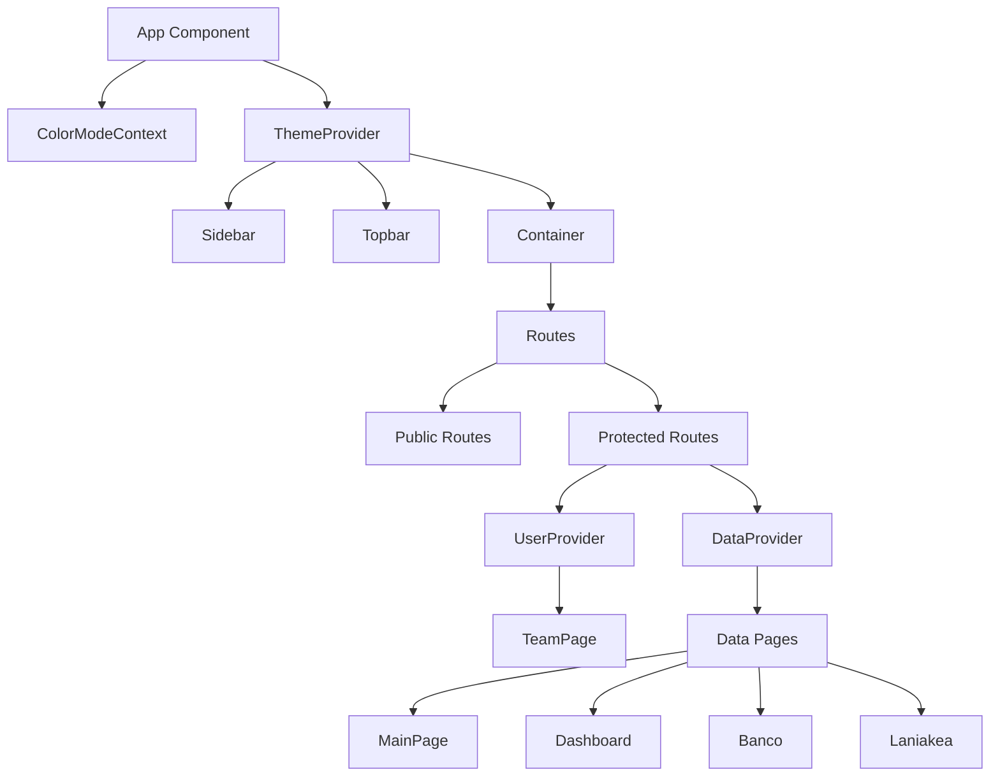
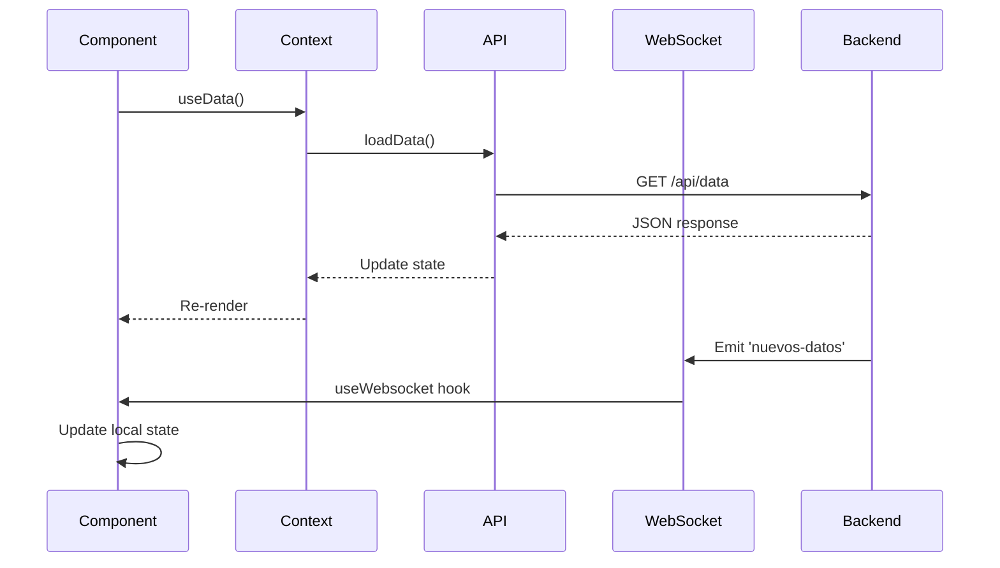

## Frontend Overview

The SAFI ControlHub frontend is a React 18 application built with Vite, featuring Material-UI components, real-time WebSocket updates, and 3D visualizations. All frontend code is in `~/workspace/source/frontend/src/`.

## Application Entry Point

### `main.jsx`

The React app is initialized here (`frontend/src/main.jsx:8`):

```javascript
import React from "react";
import ReactDOM from "react-dom/client";
import { BrowserRouter } from "react-router-dom";
import { AuthProvider } from "./context/AuthContext";
import App from "./App";
import "./index.css";

ReactDOM.createRoot(document.getElementById("root")).render(
  <React.StrictMode>
    <BrowserRouter>
      <AuthProvider>
        <App />
      </AuthProvider>
    </BrowserRouter>
  </React.StrictMode>
);
```

**Context Hierarchy**: `BrowserRouter` → `AuthProvider` → `App`

## Root Component: `App.jsx`

### Component Tree Structure



### Layout Structure (`App.jsx:40-48`)

```javascript
function App() {
  const { isAuth, loading } = useAuth();
  const [theme, colorMode] = useMode();
  const [isSidebar, setIsSidebar] = useState(true);

  return (
    <ColorModeContext.Provider value={colorMode}>
      <ThemeProvider theme={theme}>
        <CssBaseline />
        <div className="app">
          <Sidebar isSidebar={isSidebar} />
          <main className="content">
            <Topbar setIsSidebar={setIsSidebar} />
            <Container>
              {/* Routes here */}
            </Container>
          </main>
        </div>
      </ThemeProvider>
    </ColorModeContext.Provider>
  );
}
```

**Layout**: Persistent sidebar + topbar with dynamic content area.

## Routing Architecture

### Route Organization (`App.jsx:49-91`)

<Accordion title="Public Routes (Unauthenticated)">

```javascript
<Route element={<ProtectedRoute isAllowed={!isAuth} redirectTo="/login" />}>
  <Route path="/" element={<HomePage />} />
  <Route path="/about" element={<AboutPage />} />
  <Route path="/login" element={<LoginPage />} />
</Route>
```

Only accessible when user is **not** authenticated.

</Accordion>

<Accordion title="Protected Routes (Authenticated)">

```javascript
<Route element={<ProtectedRoute isAllowed={isAuth} redirectTo="/" />}>
  {/* User Management */}
  <Route element={<UserProvider><Outlet /></UserProvider>}>
    <Route path="/users" element={<TeamPage />} />
  </Route>
  
  {/* Data & Telemetry */}
  <Route element={<DataProvider><Outlet /></DataProvider>}>
    <Route path="/main" element={<MainPage />} />
    <Route path="/userslog" element={<LogPage />} />
    <Route path="/line" element={<LineChart />} />
    <Route path="/xitzin2Data" element={<Xitzin2Data />} />
    <Route path="/bancodepruebas" element={<Banco />} />
    <Route path="/dashboard" element={<Dashboard />} />
    <Route path="/filamentadora" element={<Filamentadora />} />
    <Route path="/filamentadora2" element={<Filamentadora2 />} />
    <Route path="/filamentadora3" element={<Filamentadora3 />} />
    <Route path="/laniakea" element={<Laniakea />} />
    <Route path="/hybridoperations" element={<HybridOperations />} />
  </Route>
  
  {/* User Profile */}
  <Route path="/signup" element={<RegisterPage />} />
  <Route path="/profile" element={<ProfilePage />} />
  <Route path="/users/:id/edit" element={<RegisterFormPage />} />
</Route>
```

Context providers wrap specific route groups to optimize performance.

</Accordion>

## Directory Structure

```
frontend/src/
├── main.jsx                    # Application entry
├── App.jsx                     # Root component & routing
├── index.css                   # Global styles
│
├── pages/                      # Page components (20 total)
│   ├── MainPage.jsx            # Main dashboard
│   ├── Dashboard.jsx           # Telemetry dashboard
│   ├── Banco.jsx               # Test bench monitoring
│   ├── Laniakea.jsx            # GPS tracking
│   ├── Filamentadora.jsx       # Filament winder control
│   ├── Filamentadora2.jsx      # Winder visualization
│   ├── Filamentadora3.jsx      # Advanced winder config
│   ├── HybridOperations.jsx    # Hybrid rocket operations
│   ├── Xitzin2Data.jsx         # XITZIN-II telemetry
│   ├── LineChart.jsx           # Data visualization
│   ├── LogPage.jsx             # System logs
│   ├── LoginPage.jsx           # Authentication
│   ├── HomePage.jsx            # Landing page
│   ├── AboutPage.jsx           # About information
│   ├── TeamPage.jsx            # User management
│   ├── ProfilePage.jsx         # User profile
│   ├── RegisterPage.jsx        # User registration
│   ├── RegisterFormPage.jsx    # Registration form
│   ├── VideoPlayer.jsx         # Video streaming
│   └── NotFound.jsx            # 404 page
│
├── components/                 # Reusable components
│   ├── Header.jsx
│   ├── ControlPanel.jsx        # Hardware control interface
│   ├── LineChart.jsx           # Chart component
│   ├── LogPanel.jsx            # Log display
│   ├── PatternPreview.jsx      # Pattern visualization
│   ├── LayerManager.jsx        # Layer management
│   ├── ProtectedRoute.jsx      # Route guard
│   ├── Filamentadora2D.jsx     # 2D winder view
│   ├── FilamentadoraEscena.jsx # 3D scene (Three.js)
│   ├── FilamentadoraConfigurator.jsx
│   ├── FilamentadoraSections.jsx
│   │
│   ├── navbar/                 # Navigation components
│   │   ├── Navbar.jsx
│   │   ├── Sidebar.jsx         # Collapsible sidebar
│   │   ├── Topbar.jsx          # Top navigation bar
│   │   └── navigation.jsx      # Nav configuration
│   │
│   ├── tasks/                  # Task management
│   │   └── TaskCard.jsx
│   │
│   └── ui/                     # Reusable UI primitives
│       ├── Button.jsx
│       ├── Card.jsx
│       ├── Container.jsx
│       ├── Input.jsx
│       ├── Label.jsx
│       ├── Textarea.jsx
│       └── index.js
│
├── context/                    # React Context providers
│   ├── AuthContext.jsx         # Authentication state
│   ├── DataContext.jsx         # Telemetry data
│   ├── TaskContext.jsx         # Task management
│   └── UserContext.jsx         # User management
│
├── api/                        # Backend integration
│   ├── axios.js                # Axios instance config
│   ├── socketConfig.js         # WebSocket URL
│   ├── useWebsocket.js         # WebSocket hook
│   ├── data.api.js             # Data API calls
│   ├── tasks.api.js            # Task API calls
│   └── users.api.js            # User API calls
│
├── assets/                     # Static assets
│   ├── akbal/                  # AKBAL rocket images
│   └── ensamblaje1/            # Assembly images
│
└── utils/                      # Helper functions
```

## State Management with Context

### AuthContext (`context/AuthContext.jsx`)

Manages authentication state and user session:

```javascript
const AuthContext = createContext();

export const useAuth = () => {
  const context = useContext(AuthContext);
  if (!context) throw new Error("useAuth must be used within AuthProvider");
  return context;
};

export const AuthProvider = ({ children }) => {
  const [user, setUser] = useState(null);
  const [isAuth, setIsAuth] = useState(false);
  const [loading, setLoading] = useState(true);

  // Verify JWT on mount
  useEffect(() => {
    checkAuth();
  }, []);

  return (
    <AuthContext.Provider value={{ user, isAuth, loading, signin, signup, signout }}>
      {children}
    </AuthContext.Provider>
  );
};
```

**File**: `frontend/src/context/AuthContext.jsx:1`

### DataContext (`context/DataContext.jsx`)

Provides telemetry data access methods (`frontend/src/context/DataContext.jsx:15`):

```javascript
export const DataProvider = ({ children }) => {
  const [data, setData] = useState([]);
  const [errors, setErrors] = useState({});

  const loadData = async () => {
    const res = await getAllDataRequest();
    setData(res.data);
  };

  const loadBatteries = async () => {
    const res = await getAllBatteries();
  };

  const loadXitzin2Data = async () => {
    const res = await getAllXitzin2Data();
    setData(res.data);
  };

  const loadbanco = async () => {
    const res = await getBancoData();
    setData(res.data);
  };

  return (
    <DataContext.Provider
      value={{
        data, errors,
        loadData, loadHistory, loadLogs,
        loadXitzin2Data, loadBatteries,
        loadbanco, postbanco, getignicion
      }}
    >
      {children}
    </DataContext.Provider>
  );
};
```

**Used by**: Dashboard, Banco, Laniakea, MainPage, and other data-heavy pages.

## WebSocket Integration

### Custom Hook: `useWebsocket` (`api/useWebsocket.js`)

Simplifies Socket.IO usage in components (`frontend/src/api/useWebsocket.js:4`):

```javascript
import { useState, useEffect, useRef } from 'react';
import { io } from 'socket.io-client';

export default function useWebsocket(eventName, serverUrl) {
  const [payload, setPayload] = useState([]);
  const socketRef = useRef(null);

  useEffect(() => {
    socketRef.current = io(serverUrl);

    socketRef.current.on('connect', () => {
      console.log('Socket.IO conectado con id:', socketRef.current.id);
    });

    socketRef.current.on(eventName, data => {
      console.log(`useWebsocket recibió ${eventName}:`, data.length);
      setPayload(data);
    });

    return () => {
      socketRef.current.off(eventName);
      socketRef.current.disconnect();
    };
  }, [eventName, serverUrl]);

  return payload;
}
```

### Usage in Components

```javascript
import useWebsocket from '../api/useWebsocket';
import { SOCKET_URL } from '../api/socketConfig';

function BancoPage() {
  const bancoData = useWebsocket('banco-datos', SOCKET_URL);
  
  return (
    <div>
      {bancoData.map(item => (
        <div key={item.id}>{item.fuerza}</div>
      ))}
    </div>
  );
}
```

**Available Channels**:
- `nuevos-datos` - Main telemetry
- `banco-datos` - Test bench
- `xitzin2-datos` - XITZIN-II rocket
- `baterias` - Battery status
- `laniakea` - GPS tracking
- `ignicion-estado` - Ignition commands

## HTTP API Integration

### Axios Configuration (`api/axios.js`)

```javascript
import axios from 'axios';

const instance = axios.create({
  baseURL: 'http://localhost:3000/api',
  withCredentials: true  // Include cookies
});

export default instance;
```

### API Modules

#### `data.api.js` (`api/data.api.js`)

```javascript
import axios from './axios.js';

export const getAllDataRequest = () => axios.get('/data');
export const getAllBatteries = () => axios.get('/batteries');
export const getAllXitzin2Data = () => axios.get('/xitzin2data');
export const getBancoData = () => axios.get('/bancodepruebas');
export const getLaniakeaData = () => axios.get('/laniakea');
```

#### `tasks.api.js`

```javascript
import axios from './axios.js';

export const createTaskRequest = (task) => axios.post('/tasks', task);
export const deleteTaskRequest = (id) => axios.delete(`/tasks/${id}`);
export const getTaskRequest = (id) => axios.get(`/tasks/${id}`);
export const updateTaskRequest = (id, task) => axios.put(`/tasks/${id}`, task);
```

## Component Patterns

### Protected Route Component

(`components/ProtectedRoute.jsx`):

```javascript
import { Navigate, Outlet } from 'react-router-dom';

export const ProtectedRoute = ({ isAllowed, redirectTo = '/', children }) => {
  if (!isAllowed) {
    return <Navigate to={redirectTo} replace />;
  }

  return children ? children : <Outlet />;
};
```

Used to guard routes based on authentication state.

### UI Components (`components/ui/`)

Reusable styled components:

- **Button.jsx**: Custom button with variants
- **Card.jsx**: Container with elevation
- **Container.jsx**: Responsive layout wrapper
- **Input.jsx**: Styled form input
- **Label.jsx**: Form label
- **Textarea.jsx**: Multi-line input

All exported via `components/ui/index.js` for convenience:

```javascript
import { Button, Card, Container, Input, Label } from './components/ui';
```

## 3D Visualization

### React Three Fiber

The Filamentadora pages use `@react-three/fiber` for 3D rendering:

- **FilamentadoraEscena.jsx**: Main 3D scene component
- **Filamentadora2D.jsx**: 2D canvas overlay
- **FilamentadoraConfigurator.jsx**: Control interface

Dependencies:
- `@react-three/fiber` - React renderer for Three.js
- `@react-three/drei` - Helper components
- `three` - 3D graphics library

## Material-UI Integration

The app uses Material-UI v5:

```javascript
import { CssBaseline, ThemeProvider } from "@mui/material";
import { useMode, ColorModeContext } from "../theme";

function App() {
  const [theme, colorMode] = useMode();
  
  return (
    <ColorModeContext.Provider value={colorMode}>
      <ThemeProvider theme={theme}>
        <CssBaseline />
        {/* App content */}
      </ThemeProvider>
    </ColorModeContext.Provider>
  );
}
```

Supports light/dark theme switching.

## Page Component Examples

### Banco Page (Test Bench)

Real-time test bench monitoring with WebSocket:

```javascript
import useWebsocket from '../api/useWebsocket';
import { SOCKET_URL } from '../api/socketConfig';

function Banco() {
  const bancoData = useWebsocket('banco-datos', SOCKET_URL);
  const ignicionState = useWebsocket('ignicion-estado', SOCKET_URL);
  
  // Render charts and controls
}
```

### Laniakea Page (GPS Tracking)

GPS data visualization:

```javascript
function Laniakea() {
  const laniakeaData = useWebsocket('laniakea', SOCKET_URL);
  
  // Display map with real-time GPS coordinates
}
```

## Data Flow Diagram



## Build Configuration

The frontend uses **Vite** for development and builds:

```json
{
  "scripts": {
    "dev": "vite",
    "build": "vite build",
    "preview": "vite preview"
  }
}
```

Dev server runs on `http://localhost:5173`.

## Next Steps

- [Backend Structure](/development/backend-structure) - API endpoints and controllers
- [Serial Communication](/development/serial-communication) - Hardware data integration
- [WebSocket Channels](/development/architecture-overview#real-time-data-channels) - Real-time updates