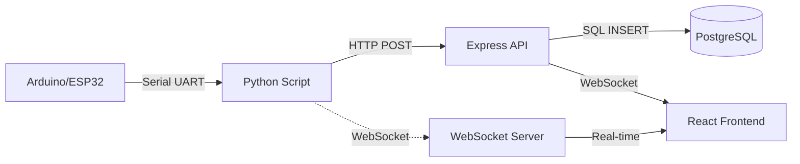
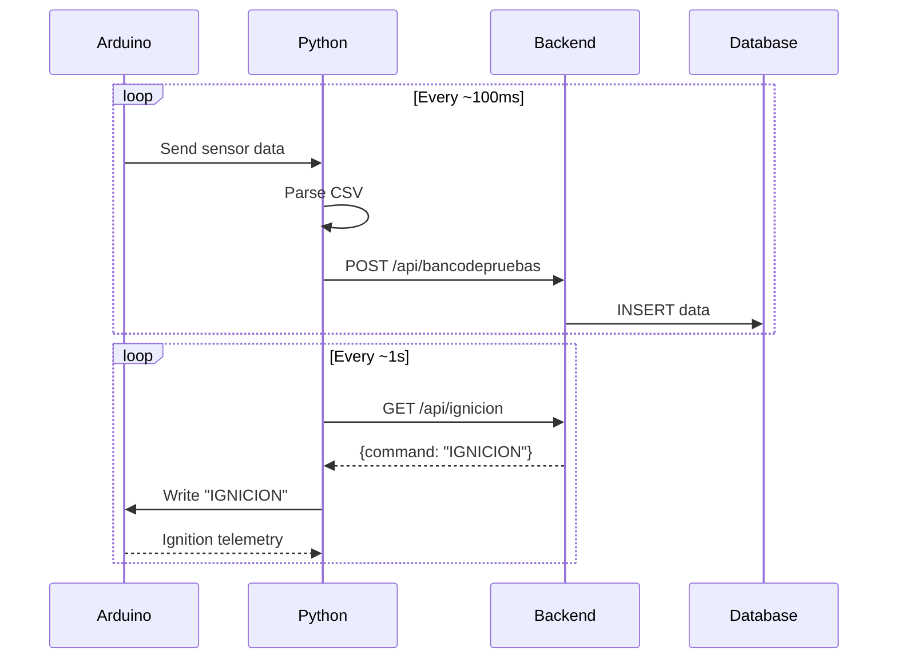
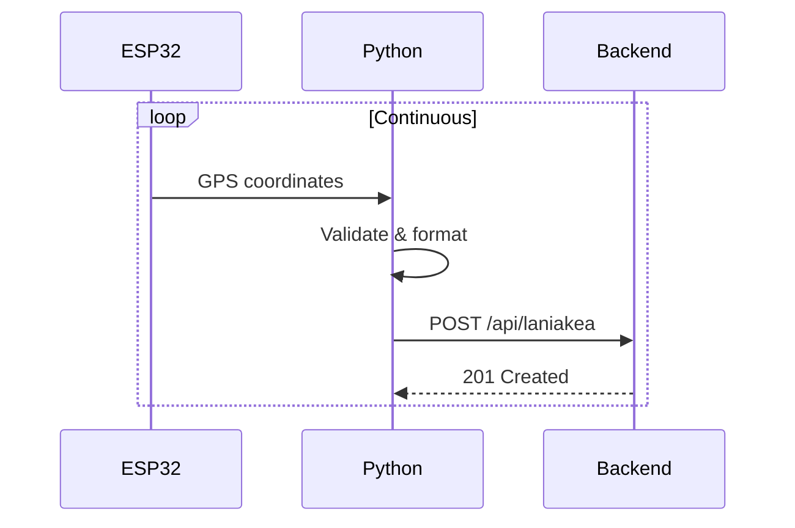

## Overview

SAFI ControlHub integrates with hardware devices via serial port communication. Python scripts read data from Arduino and ESP32 microcontrollers, then POST it to the Express backend.

## Architecture



## Python Serial Scripts

All Python scripts are located in `~/workspace/source/src/arduino/`.

### Test Bench Script: `bancodepruebas.py`

Monitors test bench sensors and handles ignition commands.

**File**: `src/arduino/bancodepruebas.py:1`

#### Configuration

```python
import serial
import requests
import time
import websocket
import json

# Serial port configuration
port = "/dev/ttyACM0"  # Change based on your system
baud_rate = 9600  

# Server URLs
server_url_data = "http://192.168.100.18:3000/api/bancodepruebas"  
server_url_command = "http://192.168.100.18:3000/api/ignicion"  

# WebSocket connection
ws = websocket.WebSocket()
try:
    ws.connect("ws://192.168.100.18:8081")
except Exception as e:
    print(f"Error al conectar a WebSocket: {e}")

# Initialize serial connection
ser = serial.Serial(port, baud_rate)
time.sleep(2)
```

<Accordion title="Serial Port Detection">

**Linux**: Use `ls /dev/tty*` to find your device:
- Arduino Uno/Mega: `/dev/ttyACM0`
- ESP32/USB adapters: `/dev/ttyUSB0`

**Permissions**: Add user to dialout group:
```bash
sudo usermod -a -G dialout $USER
```

Log out and back in for changes to take effect.

</Accordion>

#### Data Reading Loop

```python
def send_data_to_server(data):
    headers = {'Content-Type': 'application/json'}
    try:
        response = requests.post(server_url_data, json=data, headers=headers)
        if response.status_code == 200:
            return True
        else:
            print(f"Error en el POST: {response.status_code}")
            return False
    except Exception as e:
        print(f"Error al conectar con el servidor: {e}")
        return False

# Main loop
while True:
    if ser.in_waiting > 0:
        raw_data = ser.readline().decode('utf-8').strip()
        try:
            valores = raw_data.split(',')
            data = {
                "id_prueba": 0,
                "fuerza": float(valores[0]),
                "temperatura": float(valores[1]),
                "presion": float(valores[4])
            }

            # Send to database via HTTP
            if send_data_to_server(data):
                try:
                    ws.send(json.dumps(data))  # Also send via WebSocket
                except Exception as e:
                    print(f"Error enviando WebSocket: {e}")
        except Exception as e:
            print(f"Error al procesar los datos: {e}")
```

**Expected Arduino format**: Comma-separated values
```
1250.5,85.3,0,0,101.2\r\n
```

#### Ignition Command Polling

```python
def check_for_ignition_command():
    try:
        response = requests.get(server_url_command)
        if response.status_code == 200:
            command = response.json().get("command")
            if command == "IGNICION":
                print("Comando de ignición recibido: " + time.strftime("%H:%M:%S:%MS"))
                ser.write("IGNICION".encode('utf-8'))
                return True
        return False
    except Exception as e:
        print(f"Error al consultar el comando de ignición: {e}")
        return False

# Check for ignition in main loop
if check_for_ignition_command():
    try:
        ignition_data = ser.readline().decode('utf-8').strip()
        # Process ignition response
    except Exception as e:
        print(f"Error al leer datos de ignición: {e}")
```

**Flow**:
1. Frontend sends ignition command via WebSocket
2. Backend stores command in memory
3. Python script polls `/api/ignicion` endpoint
4. When command detected, sends "IGNICION" to Arduino
5. Arduino responds with ignition telemetry

### GPS Tracking Script: `laniakea.py`

Reads GPS data from ESP32 with higher baud rate.

**File**: `src/arduino/laniakea.py:1`

#### Configuration

```python
import serial
import requests
import json
from datetime import datetime

# Configuration
SERIAL_PORT = "/dev/ttyUSB0"
BAUD_RATE = 115200  # Higher baud rate for GPS data
API_URL = "http://localhost:3000/api/laniakea"

# Open serial port
try:
    ser = serial.Serial(SERIAL_PORT, BAUD_RATE, timeout=1)
    print(f"Conectado al puerto serial: {SERIAL_PORT}")
except Exception as e:
    print(f"Error abriendo el puerto serial: {e}")
    exit(1)
```

#### GPS Data Processing

```python
while True:
    try:
        line = ser.readline().decode("utf-8").strip()
        if not line:
            continue

        # Expected format: lat,long,alt
        parts = line.split(",")

        if len(parts) < 3:
            print("Trama inválida:", line)
            continue

        latitud = float(parts[0])
        longitud = float(parts[1])
        altitud = float(parts[2])

        # Build JSON payload
        payload = {
            "timestamp": datetime.now().isoformat(),
            "latitud": latitud,
            "longitud": longitud,
            "aceleracion": 0.0,
            "accel_x": 0.0,
            "accel_y": 0.0,
            "accel_z": 0.0,
            "altitud": altitud,
            "conops": "",
            "voltaje": 0.0,
            "corriente": 0.0
        }

        # POST to backend
        try:
            response = requests.post(API_URL, json=payload, timeout=5)
            if response.status_code == 201:
                print(f"✅ Enviado correctamente: {payload}")
            else:
                print(f"⚠️ Error {response.status_code}: {response.text}")
        except Exception as e:
            print(f"❌ Error al enviar POST: {e}")

    except KeyboardInterrupt:
        print("\nFinalizando programa...")
        break
    except Exception as e:
        print(f"Error general: {e}")
```

**ESP32 Output Format**:
```
19.432608,-99.133209,2240.5\r\n
```

## Node.js Serial Reader (Unused)

An alternative Node.js implementation exists in `src/SerialReader.js:1` but is not actively used:

```javascript
import SerialPort from "serialport";
import { ReadlineParser } from "@serialport/parser-readline";
import { pool } from "./db.js";

const SERIAL_PORT = "/dev/ttyUSB0";
const BAUD_RATE = 9600;

const startSerialReader = () => {
  const port = new SerialPort(SERIAL_PORT, { baudRate: BAUD_RATE });
  const parser = port.pipe(new ReadlineParser({ delimiter: "\r\n" }));

  parser.on("data", async (data) => {
    console.log("Datos recibidos:", data);
    try {
      const query = "INSERT INTO your_table (your_column) VALUES ($1)";
      await pool.query(query, [data]);
    } catch (err) {
      console.error("Error al guardar los datos:", err.message);
    }
  });
};

export default startSerialReader;
```

This is imported in `app.js:76` but **not called**. Python scripts are preferred.

## Serial Communication Patterns

### Pattern 1: Polling Loop (Test Bench)



### Pattern 2: Continuous Stream (GPS)



## Data Format Specifications

### Test Bench Data

**Arduino Output**:
```
fuerza,temperatura,reserved,reserved,presion\r\n
```

**JSON Payload**:
```json
{
  "id_prueba": 0,
  "fuerza": 1250.5,
  "temperatura": 85.3,
  "presion": 101.2
}
```

**Database Table**: `prueba_estatica_0`

### GPS Data

**ESP32 Output**:
```
latitude,longitude,altitude\r\n
```

**JSON Payload**:
```json
{
  "timestamp": "2026-03-09T14:30:45.123Z",
  "latitud": 19.432608,
  "longitud": -99.133209,
  "altitud": 2240.5,
  "aceleracion": 0.0,
  "accel_x": 0.0,
  "accel_y": 0.0,
  "accel_z": 0.0,
  "conops": "",
  "voltaje": 0.0,
  "corriente": 0.0
}
```

**Database Table**: `datos_laniakea`

## Error Handling

### Connection Errors

```python
try:
    ser = serial.Serial(SERIAL_PORT, BAUD_RATE, timeout=1)
    print(f"Conectado al puerto serial: {SERIAL_PORT}")
except Exception as e:
    print(f"Error abriendo el puerto serial: {e}")
    exit(1)
```

### Data Parsing Errors

```python
try:
    valores = raw_data.split(',')
    data = {
        "fuerza": float(valores[0]),
        "temperatura": float(valores[1]),
        "presion": float(valores[4])
    }
except Exception as e:
    print(f"Error al procesar los datos: {e}")
    continue  # Skip invalid data
```

### Network Errors

```python
try:
    response = requests.post(API_URL, json=payload, timeout=5)
    if response.status_code == 201:
        print(f"✅ Enviado correctamente")
    else:
        print(f"⚠️ Error {response.status_code}: {response.text}")
except Exception as e:
    print(f"❌ Error al enviar POST: {e}")
    # Data is lost - consider implementing retry logic
```

## Additional Python Scripts

Other scripts in `src/arduino/`:

<Accordion title="LoRa_cv.py">

LoRa communication for long-range telemetry (2,759 bytes).

**File**: `src/arduino/LoRa_cv.py:1`

</Accordion>

<Accordion title="calculos_filamentadora.py">

Calculations for filament winding machine (2,747 bytes).

**File**: `src/arduino/calculos_filamentadora.py:1`

</Accordion>

<Accordion title="pruebabancodepruebas.py">

Test bench validation script (12,399 bytes - largest script).

**File**: `src/arduino/pruebabancodepruebas.py:1`

</Accordion>

<Accordion title="graph.py">

Data graphing utilities (826 bytes).

**File**: `src/arduino/graph.py:1`

</Accordion>

<Accordion title="winder1.java">

Java implementation for filament winder control (5,277 bytes).

**File**: `src/arduino/winder1.java:1`

</Accordion>

## Running Serial Scripts

### Prerequisites

```bash
pip install pyserial requests websocket-client
```

### Start Script

```bash
cd ~/workspace/source/src/arduino
python3 bancodepruebas.py
```

**Expected Output**:
```
Conectado al puerto serial: /dev/ttyACM0
Datos recibidos: 1250.5,85.3,0,0,101.2
✅ Enviado correctamente: {'fuerza': 1250.5, ...}
```

### Run as Service

Create systemd service file `/etc/systemd/system/safi-serial.service`:

```ini
[Unit]
Description=SAFI Serial Reader
After=network.target

[Service]
Type=simple
User=your-user
WorkingDirectory=/home/your-user/workspace/source/src/arduino
ExecStart=/usr/bin/python3 bancodepruebas.py
Restart=on-failure

[Install]
WantedBy=multi-user.target
```

Enable and start:
```bash
sudo systemctl enable safi-serial
sudo systemctl start safi-serial
sudo systemctl status safi-serial
```

## Troubleshooting

### Port Not Found

**Error**: `serial.serialutil.SerialException: [Errno 2] could not open port /dev/ttyACM0`

**Solutions**:
1. Check port exists: `ls -l /dev/tty*`
2. Verify permissions: `sudo chmod 666 /dev/ttyACM0`
3. Add user to dialout group: `sudo usermod -a -G dialout $USER`

### Permission Denied

**Error**: `PermissionError: [Errno 13] Permission denied: '/dev/ttyACM0'`

**Solution**:
```bash
sudo usermod -a -G dialout $USER
# Log out and back in
```

### Connection Refused

**Error**: `requests.exceptions.ConnectionError: ('Connection aborted.', ...)`

**Solutions**:
1. Verify backend is running: `curl http://localhost:3000/api/ping`
2. Check firewall rules
3. Update server URL in Python script

### Invalid Data Format

**Error**: `ValueError: could not convert string to float`

**Solutions**:
1. Print raw data: `print(repr(raw_data))`
2. Check Arduino serial output format
3. Verify delimiter matches Arduino code
4. Handle empty values: `float(valores[0] or 0)`

## Next Steps

- [Backend Structure](/development/backend-structure) - API endpoints receiving serial data
- [WebSocket Architecture](/development/architecture-overview#real-time-data-channels) - Real-time data distribution
- [Frontend Structure](/development/frontend-structure) - Displaying telemetry in React